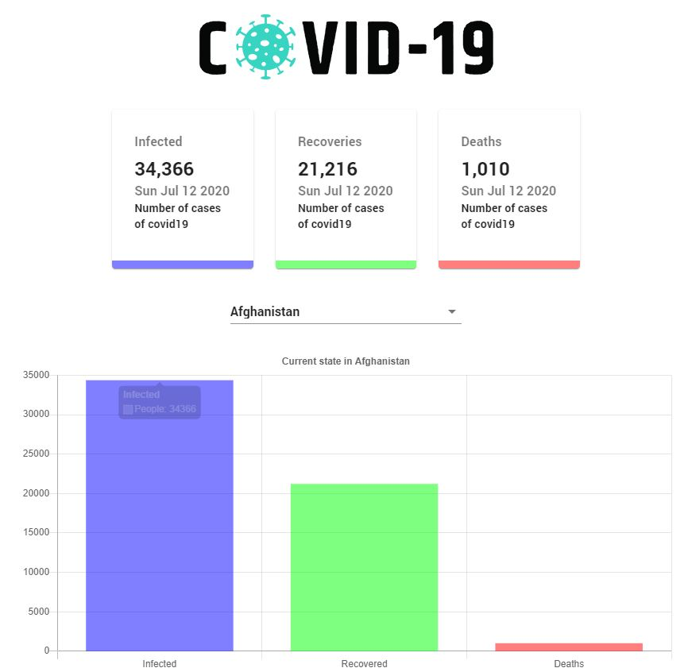

# COVID-19 Tracker

## **<a href="#" target="_blank">Click here to demo</a>**

> A clean and simple web app that displays COVID-19 statistics utilizing The Mathdroid API from John Hopkins University

---

## Features

-   Receive latest statistics on the novel coronavirus
    s
-   Get country-specific data presented in easily comprehensible charts

---

## Libraries and Technologies

-   Uses React, React Hooks and Material UI
-   Uses Axios for data fetching
-   Styled with CSS modules
-   Uses Chart.js for charts

---
